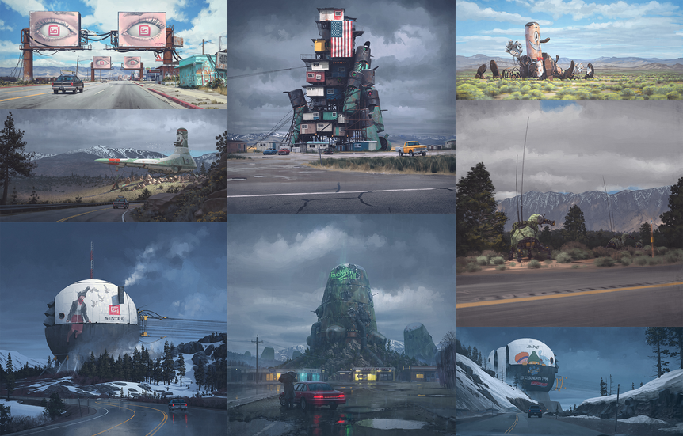
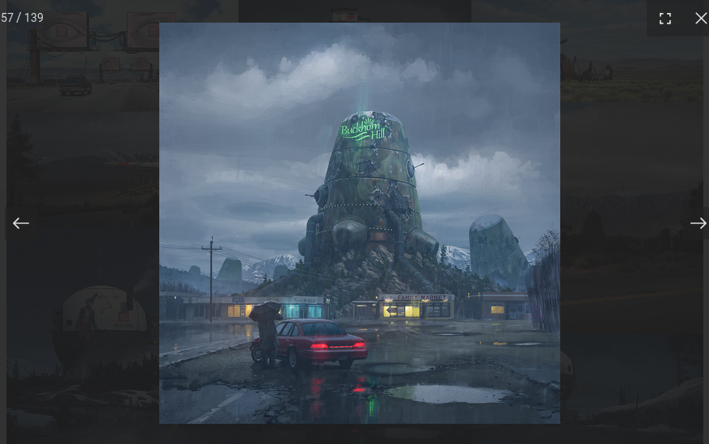

Simon
=====

Art gallery application for [Simon Stålenhag's](https://simonstalenhag.se/) artwork
-----------
The application automatically scrapes [Simon Stålenhag's website](https://simonstalenhag.se/), 
skips so-called detailed images and only downloads thumbnails and full-size images. 
After that, it generates an HTML page which presents the downloaded artwork in a very accessible 
manner by creating an online gallery where users can navigate with ease and be able to see the 
full-size images without leaving the main page and opening unnecessary browser tabs.

How to build
------------
* Clone this repository
* Run `mvn package` inside the project folder in order to build the project artifact
* Inside the project folder `cd ./target` and then `java -jar ./simon.jar` in order to start 
the 
web scraper and generate the HTML page
* Inside the project folder `docker build -t simon .` to build a Docker image 

How to run
----------
* Use the `start.sh` script to start the app inside a Docker container
* Run the `stop.sh` script to stop the app

How to use
----------
After you start the app with the `start.sh` script, the application will be available at 
`http://localhost:8080`.